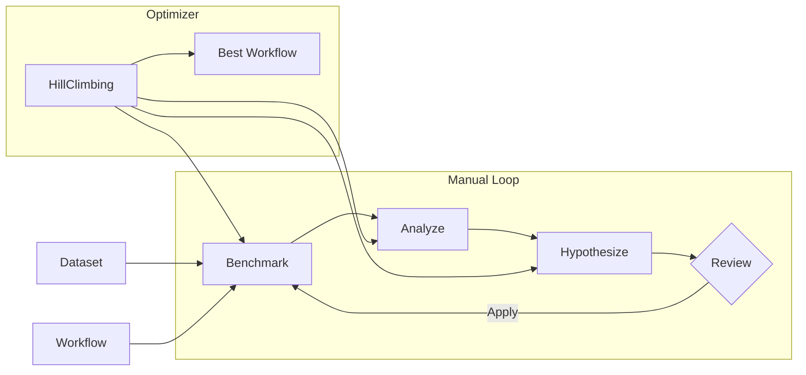

# Benchmark & Optimization System

This document explains the benchmark system for testing and improving PolicyFlow workflows.

## What is the Benchmark System?

The benchmark system enables systematic improvement of workflow accuracy through:

- **Golden Datasets**: Test cases with known expected outcomes
- **Performance Metrics**: Accuracy, precision, recall, and F1 per criterion
- **Failure Analysis**: Pattern detection across test categories
- **Improvement Hypotheses**: Actionable suggestions for workflow changes
- **Experiment Tracking**: Compare runs and track progress over time

**Use this when you want to**:
- Measure baseline workflow performance
- Identify systematic failure patterns
- Generate and test improvement ideas
- Prevent regressions when making changes

## Design Principles

### Measurement Before Improvement

**The Problem**: Without metrics, optimization is guesswork. How do you know if a prompt change helped or hurt?

**The Solution**: Golden datasets provide ground truth. Each test case has expected outcomes at every level—overall policy satisfaction, per-criterion results, and intermediate states.

Categories of test cases:
- `clear_pass` - Text that obviously satisfies the policy
- `clear_fail` - Text that obviously fails
- `edge_case` - Boundary conditions and ambiguous inputs
- `partial_match` - Some criteria pass, others fail

### Systematic Failure Analysis

**The Problem**: Random debugging doesn't scale. When a workflow has 85% accuracy, where do you focus?

**The Solution**: The analyzer detects patterns across failures:

| Pattern Type | Description | Example |
|-------------|-------------|---------|
| Category Cluster | High failure rate in specific categories | "Edge cases fail 60% vs 10% for clear cases" |
| Criterion Systematic | One criterion fails consistently | "Criterion 3 fails in 40% of tests" |
| FP/FN Imbalance | False positives vs false negatives skewed | "80% of errors are false positives" |
| Confidence Miscalibration | High-confidence answers are wrong | "High confidence correct only 70%" |

### Actionable Hypotheses

**The Problem**: Knowing what's wrong doesn't mean knowing how to fix it. "Criterion 3 fails often" isn't actionable.

**The Solution**: Hypotheses include specific changes with rationales:

| Change Type | What It Does | Example |
|-------------|--------------|---------|
| `node_param` | Adjust node parameters | Lower confidence threshold to 0.6 |
| `prompt_tuning` | Update prompt templates | Add clarifying examples |
| `workflow_structure` | Add/remove/rewire nodes | Insert confidence gate after classifier |
| `threshold` | Adjust decision boundaries | Raise acceptance threshold to 0.85 |

### Controlled Experimentation

**The Problem**: Ad-hoc changes may improve one case but regress others. Without tracking, you can't tell.

**The Solution**: Every benchmark run is an experiment. The tracker stores:
- Workflow snapshot (exact config used)
- Dataset version
- Full results and metrics
- Hypothesis that was applied (if any)

Compare experiments to verify improvements and catch regressions.

### Extensible by Design

**The Problem**: Different domains need different optimization strategies. Financial compliance has different patterns than content moderation.

**The Solution**: Protocol-based interfaces let you swap implementations:
- Custom analyzers for domain-specific patterns
- Custom hypothesis generators for specialized fixes
- Alternative optimizers (Bayesian, evolutionary)

---

## System Overview

```
┌─────────────────┐
│ Golden Dataset  │  ← Test cases with expected results
└────────┬────────┘
         │
         ▼
┌─────────────────┐
│ Benchmark       │  ← Run workflow against tests
└────────┬────────┘
         │
         ▼
┌─────────────────┐
│ Analysis        │  ← Identify failure patterns
└────────┬────────┘
         │
         ▼
┌─────────────────┐
│ Hypotheses      │  ← Generate improvements
└────────┬────────┘
         │
         ▼
┌─────────────────┐
│ Human Review    │  ← Approve/reject changes
└────────┬────────┘
         │
         ▼
┌─────────────────┐
│ Apply & Repeat  │  ← Iterate until satisfied
└─────────────────┘
```

### Manual vs Automated Optimization

The system supports both workflows:



**Manual loop**: You review each hypothesis before applying. Better control, more oversight.

**Automated optimizer**: Applies hypotheses automatically, stops when budget exhausted or target reached. Faster iteration, less control.

---

## Core Concepts

| Concept | Purpose | Key Details |
|---------|---------|-------------|
| **Golden Dataset** | Ground truth test cases | Categories: clear_pass, clear_fail, edge_case, partial_match |
| **Benchmark Report** | Performance snapshot | Overall accuracy, per-criterion P/R/F1, confidence calibration |
| **Failure Pattern** | Systematic issue | Category clusters, criterion failures, FP/FN imbalance |
| **Hypothesis** | Improvement suggestion | Types: node_param, prompt_tuning, workflow_structure, threshold |
| **Optimization Budget** | Stopping criteria | max_iterations, max_llm_calls, target_accuracy, patience |
| **Experiment** | Tracked run | Workflow snapshot + dataset + results + applied hypothesis |

---

## CLI Commands

### Generate Test Dataset

Create a golden dataset from a normalized policy:

```bash
policyflow generate-dataset --policy normalized.yaml --output golden_dataset.yaml
```

**Key options**:
| Option | Description |
|--------|-------------|
| `--policy/-p` | Path to normalized policy YAML |
| `--output/-o` | Output path for generated dataset |
| `--cases-per-criterion/-n` | Test cases per criterion (default: 3) |
| `--edge-cases/--no-edge-cases` | Include edge cases (default: yes) |
| `--partial-matches/--no-partial-matches` | Include partial matches (default: yes) |
| `--mode` | Generation mode: `template`, `llm`, `hybrid` (default: hybrid) |

### Run Benchmark

Measure workflow performance against a dataset:

```bash
policyflow benchmark --workflow workflow.yaml --dataset golden_dataset.yaml --output report.yaml
```

**Key options**:
| Option | Description |
|--------|-------------|
| `--workflow/-w` | Path to workflow YAML |
| `--dataset/-d` | Path to golden dataset YAML |
| `--output/-o` | Output path for benchmark report |
| `--category/-c` | Filter tests by category |
| `--limit/-l` | Limit number of test cases |

**Output includes**: Overall accuracy, category breakdown, per-criterion metrics, failure preview.

### Analyze Failures

Identify patterns in benchmark failures:

```bash
policyflow analyze --report report.yaml --workflow workflow.yaml --output analysis.yaml
```

**Key options**:
| Option | Description |
|--------|-------------|
| `--report/-r` | Path to benchmark report |
| `--workflow/-w` | Path to workflow YAML |
| `--mode` | Analysis mode: `rule_based`, `llm`, `hybrid` (default: hybrid) |
| `--model/-m` | Model for LLM analysis |

### Generate Hypotheses

Create improvement suggestions from analysis:

```bash
policyflow hypothesize --analysis analysis.yaml --workflow workflow.yaml --output hypotheses.yaml
```

**Key options**:
| Option | Description |
|--------|-------------|
| `--analysis/-a` | Path to analysis report |
| `--workflow/-w` | Path to workflow YAML |
| `--mode` | Mode: `template`, `llm`, `hybrid` (default: hybrid) |

### Automated Optimization

Run the full optimization loop:

```bash
policyflow optimize --workflow workflow.yaml --dataset golden_dataset.yaml --output optimized.yaml
```

**Key options**:
| Option | Description |
|--------|-------------|
| `--max-iterations` | Maximum optimization iterations (default: 10) |
| `--target` | Stop when this accuracy is reached |
| `--patience` | Stop after N iterations without improvement (default: 3) |
| `--limit/-l` | Limit test cases per iteration |

**Convergence reasons**:
- `target_reached` - Achieved target accuracy
- `max_iterations` - Budget exhausted
- `no_improvement` - Patience exceeded
- `no_hypotheses` - No more improvements to try

### Full Improvement Pipeline

Run benchmark → analyze → hypothesize → optimize in one command:

```bash
policyflow improve --workflow workflow.yaml --dataset golden_dataset.yaml --output improved.yaml
```

Same options as `optimize`.

### Track Experiments

```bash
# List all experiments
policyflow experiments list

# Show best-performing experiment
policyflow experiments best

# Compare two experiments
policyflow experiments compare exp_001 exp_002
```

---

## Extending the System

The benchmark system uses Python Protocols for extensibility. Implement these interfaces to customize behavior.

### Available Protocols

| Protocol | Purpose | When to Implement |
|----------|---------|-------------------|
| `FailureAnalyzer` | Detect failure patterns | Domain-specific pattern recognition |
| `HypothesisGenerator` | Generate improvements | Custom fix strategies |
| `HypothesisApplier` | Apply changes to workflow | New change types |
| `Optimizer` | Control optimization loop | Alternative algorithms |
| `DatasetGenerator` | Generate test cases | Custom test case strategies |

### Protocol Signatures

```python
class FailureAnalyzer(Protocol):
    def analyze(
        self,
        report: BenchmarkReport,
        workflow: ParsedWorkflowPolicy
    ) -> AnalysisReport: ...

class HypothesisGenerator(Protocol):
    def generate(
        self,
        analysis: AnalysisReport,
        workflow: ParsedWorkflowPolicy
    ) -> list[Hypothesis]: ...

class Optimizer(Protocol):
    def optimize(
        self,
        workflow: ParsedWorkflowPolicy,
        dataset: GoldenDataset,
        budget: OptimizationBudget,
        metric: Callable[[BenchmarkReport], float]
    ) -> OptimizationResult: ...
```

### Using Custom Implementations

Factory functions select implementations by mode:

```python
from policyflow.benchmark import (
    create_analyzer,
    create_hypothesis_generator,
    create_optimizer,
)

# Built-in modes
analyzer = create_analyzer(mode="hybrid")  # rule_based, llm, or hybrid
generator = create_hypothesis_generator(mode="template")  # template, llm, or hybrid

# Or instantiate directly
from policyflow.benchmark import RuleBasedAnalyzer, LLMEnhancedAnalyzer

analyzer = LLMEnhancedAnalyzer(model="anthropic/claude-sonnet-4-20250514")
```

### Future Extension Points

The `Optimizer` protocol enables alternative optimization strategies:

| Strategy | Description |
|----------|-------------|
| Bayesian | Parameter search with acquisition functions |
| Evolutionary | Population-based search over configs |
| DSPy-style | Few-shot example optimization |
| LLM Meta | LLM proposes and evaluates changes |

Implement the `Optimizer` protocol and pass to the optimization pipeline.

---

## Configuration

### Model Selection

The benchmark system follows PolicyFlow's model selection hierarchy:

1. Explicit `--model` flag or parameter
2. Task-specific env var (`GENERATE_MODEL`, `ANALYZE_MODEL`, `OPTIMIZE_MODEL`)
3. Global default (`POLICY_EVAL_MODEL`)
4. Hardcoded fallback

```bash
# Set task-specific models
export GENERATE_MODEL=anthropic/claude-opus-4-5-20251101
export ANALYZE_MODEL=anthropic/claude-sonnet-4-20250514
export OPTIMIZE_MODEL=anthropic/claude-sonnet-4-20250514
```

### Key Environment Variables

| Variable | Purpose | Default |
|----------|---------|---------|
| `POLICY_EVAL_MODEL` | Global default model | claude-sonnet-4-20250514 |
| `GENERATE_MODEL` | Dataset generation | (inherits) |
| `ANALYZE_MODEL` | Failure analysis | (inherits) |
| `OPTIMIZE_MODEL` | Optimization loop | (inherits) |
| `POLICY_EVAL_CONFIDENCE_HIGH` | High confidence threshold | 0.8 |
| `POLICY_EVAL_CONFIDENCE_LOW` | Low confidence threshold | 0.5 |

---

## Quick Start

End-to-end workflow in 5 steps:

```bash
# 1. Generate test dataset from your normalized policy
policyflow generate-dataset --policy normalized.yaml --output golden_dataset.yaml

# 2. Run initial benchmark to establish baseline
policyflow benchmark --workflow workflow.yaml --dataset golden_dataset.yaml --output baseline.yaml

# 3. Analyze failures to understand what's wrong
policyflow analyze --report baseline.yaml --workflow workflow.yaml --output analysis.yaml

# 4. Generate improvement hypotheses
policyflow hypothesize --analysis analysis.yaml --workflow workflow.yaml --output hypotheses.yaml

# 5. Review hypotheses.yaml, then run optimization
policyflow optimize --workflow workflow.yaml --dataset golden_dataset.yaml \
    --max-iterations 5 --target 0.95 --output optimized.yaml
```

Or use the convenience command for the full loop:

```bash
policyflow improve --workflow workflow.yaml --dataset golden_dataset.yaml \
    --max-iterations 5 --output improved.yaml
```

---

## Related Documentation

- [Concepts & Workflow](concepts.md) - Core concepts and two-step parsing
- [User Guide](USERGUIDE.md) - Complete usage guide
- [Source Code Guide](source-guide.md) - Implementation details and code structure
- [CLI Cheatsheet](cli-cheatsheet.md) - Quick command reference
